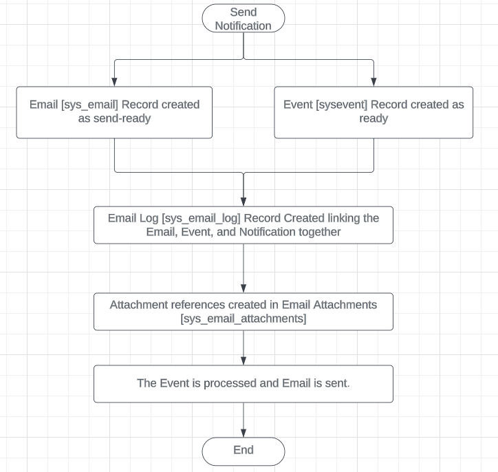

# Add Attachments from Attachment Fields in Notifications

When ServiceNow introduced the ability to create attachment fields in forms, this opened up a lot of possible solutions that previously didn't exist. Then the requirement came to send that attachment out via email and there wasn’t an OOB way of making this happen. Well, that I’ve found…

When this was asked for by a stakeholder last year, I started digging into the weeds on how best to go about this. I decided to review the current process of getting attachments onto notifications attempting to piggyback off of these methods to keep it as clean as possible.

The current process involves the Email [_sys_email_] record being created as a Type of **send-ready**. Then an Email Log [_sys_email_log_] record gets created linking the Event [_sysevent_] to process the notification, the Email [_sys_email_] record, and the Notification [_sysevent_email_action_]. 

Meaning, it is queued for send after some processing happens to gather the attachments (if needed), which are stored in the Email Attachments [_sys_email_attachment_] table and linked back to the Email [_sys_event_] record. Eventually, once all that processing takes place it picks up the email and sends the notification, changing the Type to sent.

See the image below for what I have learned about this process:


To add the attachments for Attachment fields on the form, we are going to do the following.

1. Create a list field to hold our Attachment fields as reference.

    - This will allow us to point to multiple fields when we gather our attachment references.

2. Create a Business Rule to create our Attachment reference records after inserting of Email Log [_sys_email_log_].

    - For this use case, I created the Business Rule to only run if the Attachment Field list on the Notification record wasn’t empty. So this would not run every time a notification was sent. Below is the code for that business rule.


```js
(function executeRule(current, previous /*null when async*/ ) {
    // Get the field names (also known as Column Labels on sys_dictionary)
    var fields = current.notification.u_included_attachments.getDisplayValue();
    if (!fields) return; //end if nothing found

    // current.notification.collection = a field 
    //     labeled Table on the Notification record.
  
    // current.email.instance = The field labeled 
    //     Target on the Email record (or sys_id). 
    var targetRecord = new GlideRecord(current.notification.collection);
    targetRecord.get(current.email.instance);
    if (!targetRecord.isValidRecord()) return; // do nothing if we have nothing

    
    // Get the sys_id(s) of the attachment records
    // to make our references in the Email Attachments table
    var list = [];
    fields = fields.split(',');
    fields.forEach(function(field) {
        var record = getAttachment(targetRecord.getValue(field));
        if (record.isValidRecord()) list.push(record);
    });

    
    // Create our references if we have a valid list of records. 
    if (list && list.length > 0) {
        list.forEach(function(item) {
            createEmailAttachment(item.getValue('sys_id'), 
                    item.getValue('file_name'), 
                    current.getValue('email'));
        });
    }

    // gets the attachment and returns the glidrecord 
    function getAttachment(_id) {
        var attachment = new GlideRecord('sys_attachment');
        attachment.get(_id);
        return attachment;
    }

    // creates our reference record with some defaulted options
    function createEmailAttachment(_attachmentId, _attachmentName, _emailId) {
        var emailAttachment = new GlideRecord('sys_email_attachment');
        emailAttachment.initialize();
        emailAttachment.setValue('attachment', _attachmentId);
        emailAttachment.setValue('file_name', _attachmentName);
        emailAttachment.setValue('email', _emailId);
        emailAttachment.setValue('source', 'notification');
        emailAttachment.setValue('content_disposition', 'attachment');
        emailAttachment.insert();
    }

})(current, previous);
```
_Testing_:

I created a notification to trigger an event and then created a script (below) to pull a default record with my attachment field set with an attachment. After running it, I was able to confirm each record had a reference to my attachment by filtering the Email Attachments [_sys_email_attachment_] table.

```js
// Get the sample record to send for our notification
var current = new GlideRecord('your_table_here');
    current.get('sample_record_sys_id_with_attachment_field_on_form');
    
if(current.isValidRecord()){
    // if valid trigger event
    var counter = 0;
    while(counter < 101){
        gs.eventQueue('notification_event_name', 
                current, 
                'event_param1', 
                'event_param2');
        counter++;
    }
    gs.info('You sent '+counter+' notifications');
}
```

This worked well for our use case. Please let me know if you have run into this and how you solved it.

Thank you for reading!