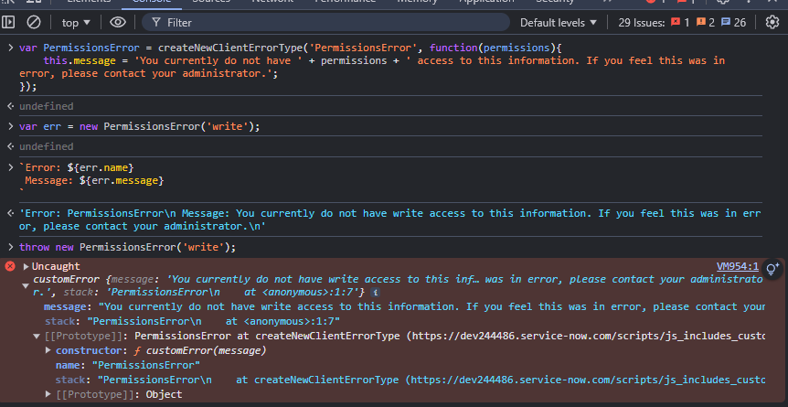

# Building Custom Errors


When building features or custom applications in ServiceNow, it is sometimes nice to have custom errors that further describe what is happening. There are many ways to do this, but I am going to share some functions I've used that have worked well for me during my time on the platform.

Below is an example of a code snippet that is reusable whenever I've needed a new error type.

```js
function createNewErrorType(errorName, initFunction){
	function customError(message){
		// if captureStackTrace is not available, use default error stack
		if(!Error.captureStackTrace){
			this.stack = (new Error()).stack;
		}else{
			Error.captureStackTrace(this, this.constructor);
		}
		// set the message passed and apply passed arguments to 
		// the newly created error function
		this.message = message;
		initFunction && initFunction.apply(this, arguments);
	}
	customError.prototype = new Error();
	customError.prototype.name = errorName;
	customError.prototype.constructor = customError;
	return customError;
}
// Example use: 
var PermissionsError = createNewErrorType('PermissionsError', function(permissions){
	this.message = 'You currently do not have ' + permissions + ' access to this information. If you feel this was in error, please contact your administrator.';
});

throw new PermissionsError('read');
```

## Code Explained:
The first function, _createNewErrorType_, will be called whenever a new custom error is needed. The function customError builds out the error, and adds your custom attributes to the function prototype then returns it for use later in your script.

In this example, PermissionsError is created using the createNewErrorType function where we are passing the name of the error and the function that should be called when invoked.

When running this in **System Definition > Scripts-Background**, you should see something like the below message when the error is thrown.

```
Error Description: PermissionsError: You currently do not have read access to this information. If you feel this was in error, please contact your administrator. (null.null.script; line 24)
```

In server-side logic, this works pretty well. You can check the instance of the Error in case you want to do something specific when this error is thrown.

```js
try{
	throw new PermissionsError('read');
}catch(err){
	if(err instanceof PermissionsError) gs.info(err.name); // prints PermissionsError
} 
```

You can format it to a specific output.
```js
try{
	throw new PermissionsError('read');
}catch(err){
	gs.info(gs.getMessage('Error: {0}\nMessage: {1}\nStack: {2}',[
		err.name,
		err.message,
		err.stack
	]));
} 

/**
 * Prints:
 * Error: PermissionsError
 * Message: You currently do not have read access to this information. If you feel this was in error, 
 * please contact your administrator.
 * Stack: at null.null.script:25
 */
```

The _createNewErrorType_ can be set in a **Script Include** like the example below and be called anywhere you need it server side.


You can also add it to a **UI Script**. However, an update to the name may be in order so your fellow devs and you won't be confused when seeing it in other scripts. We can call this one _createNewClientErrorType_.


This client script is set to be used on the Desktop (platform side) and Global so it is loaded anytime a page is loaded in the platform. You should now be able to use it in your client scripts.

We can test this in the console after creating the record.




Custom errors are a great way to further describe issues that happen in your code. Using custom errors allows you to describe expected events that can be handled in very specific ways and provide your users and development team with great experiences. I hope you have enjoyed this article.

Thank you for reading! :)