# Installing Multiple MID Servers on a Linux Distro

Have you ever needed to install multiple MID Servers on Linux? I’ve been able to do this and wanted to share my journey in this walk-through.

The business case for this adventure was that the lower environments would not pull information all the time like our prod instance. To save on cost, it was decided to add two MID Server services to a single Linux server. It is important to note the minimal requirements for each MID Server [here](https://www.servicenow.com/docs/bundle/xanadu-servicenow-platform/page/product/mid-server/reference/r_MIDServerSystemRequirements.html).

## Example Setup

I currently have an Ubuntu Server 22.04 set up on my local machine in VirtualBox with 4GB of RAM and 2 Processors. I’m using a PDI (Personal Developer Instance) in the example images provided. You can obtain one from the [ServiceNow Developer](https://developer.servicenow.com/dev.do) site for free.

## Create a MID Server User
If you’ve not set up a MID Server before, you will need to create a user record for authentication into the ServiceNow instance. We will do this by navigating to **All > User Administration > Users**.

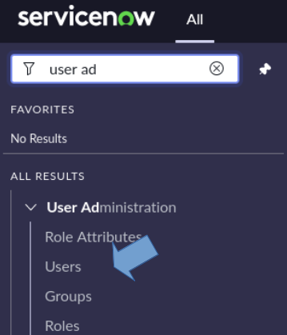

After clicking on the Users module, you should be able to see the New button in the upper right corner. Click New and fill in the following information.

- User ID: mid.user
- First Name: Dev
- Last Name: MID Server
- Web Service access only: True
- Active: (should be True by default)
- Then right-click the context header and click Save.


>**TIP**: A naming convention can be used for a User ID that further describes the service you are going to use with your MID Server. This can be handy during filtering, especially if you are using your MID Server for Discovery or Service Mapping.

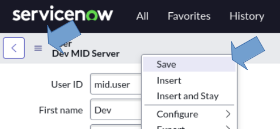

Once saved, you will need to add the role mid_server to the account. This can be done by selecting the Roles tab at the bottom of the form. The mid_server role contains other roles, so you will see others added as well on save.

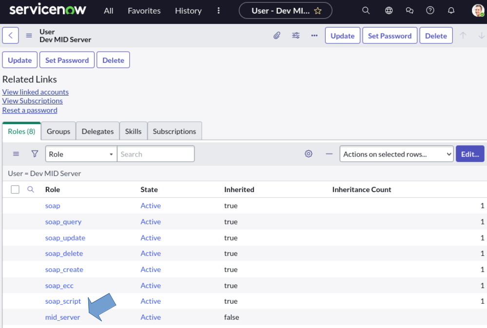

Next, navigate to **MID Server > Downloads**.

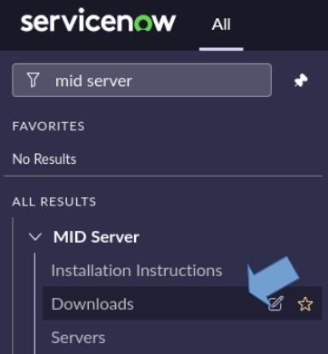

On the downloads page, you’ll want to check the ***Download MID Server as ZIP archive*** box and copy the link to download 64bit Linux.

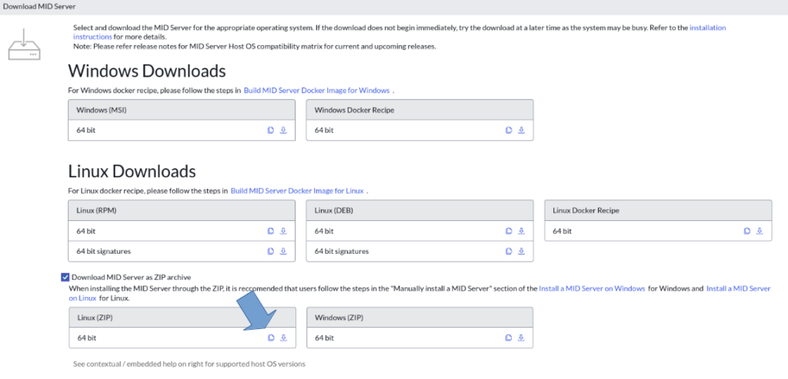

Then log into your Linux Server either via ssh or directly in the console if available and we will begin the process of setting up our structure and first MID Server.

## MID Installation
To get started, we need to pull down the .zip file from ServiceNow. To do this we are going to use wget. If you haven’t used it before you can read more about it [here](https://www.gnu.org/software/wget/manual/wget.html).

```sh
# The wget command should look something like this:
wget <your_copied_link> -O <output_file_name>

# The command I used: 

wget https://install.service-now.com/glide/distribution/builds/package/app-signed/mid/2023/06/23/mid.utah-12-21-2022__patch4-hotfix2-06-23-2023_06-23-2023_2224.linux.x86-64.zip -O mid.zip
```

Once completed you can use the ls command to see files available to you in the current directory.

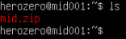

## Installing Helpful Tools
During the setup of my Ubuntu virtual machine, I chose to install the minimal version, so I need to install a few tools to assist in further installation. You may not need to do this.

If not, feel free to skip this section.

I’m going to install these using [apt](https://manpages.ubuntu.com/manpages/xenial/man8/apt.8.html), Ubuntu’s package manager:

- [unzip](https://linux.die.net/man/1/unzip) - used to unzip archives

- [tree](https://linux.die.net/man/1/tree) - useful to list out directories and files in a tree-like structure

- [nano](https://www.nano-editor.org/) - a file editor that will be needed later to configure our MID Server XML files.

```sh
sudo apt install unzip nano tree
```

## Placing an Agent

Now that we have our necessary tools we are going to unzip the mid.zip archive, create our two directories for our separate MID Servers, and set up our first service.

```sh
# Expand the zip file
unzip mid.zip 

# Make your dev and stage directories
sudo mkdir -p /opt/servicenow/{dev,stage}

# Copy your agent folder to each location
sudo cp -r ./agent /opt/servicenow/dev
sudo cp -r ./agent /opt/servicenow/stage

# Confirm your folder structure with tree to the third level
tree /opt -L 3
```

Once you run the tree command you should see something like this.

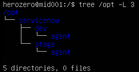

## Configuring our Dev Agent

Next, we are going to change to the directory of our dev agent and begin to configure our first MID Server. Inside the agent directory, we’ll need to open config.xml with nano and update four parameters.

- url - the URL for the ServiceNow instance you are attempting to communicate with.

- mid.instance.username - this is the user_id of the account created previously.

- mid.instance.password - the password saved earlier during the creation of your account.

- name - the name you want your MID Server identified with.


>**TIP**: In the past, I have found it useful to use a naming convention for the mid servers I set up. The one I am going to use here is [environment].[purpose].[server_name]. This is not a requirement but something to consider when you set up your next server.

```sh
# Change to your dev directory
cd /opt/servicenow/dev/agent

# Edit your config.xml file
sudo nano config.xml
```

Ctrl+X, then Y, and Enter to confirm the save and exit of the nano editor.

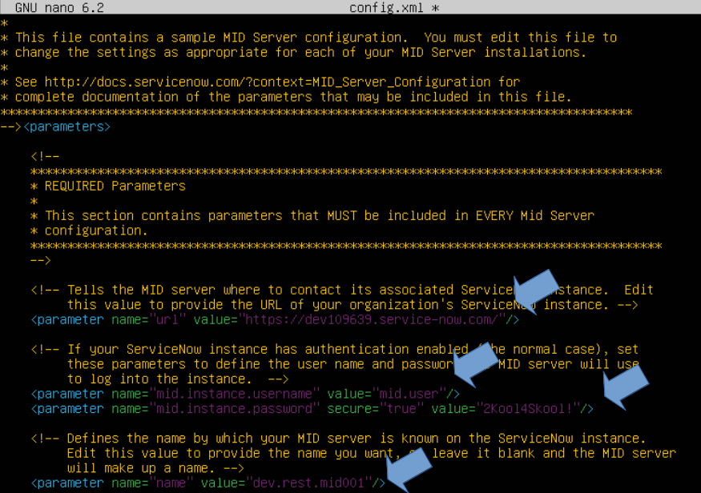

Once you have this set, you can then start the Mid Server and confirm a connection to your instance. You can see the new MID Server record if successful in ServiceNow by navigating to Mid Server > Servers and refreshing the list periodically during the starting process.

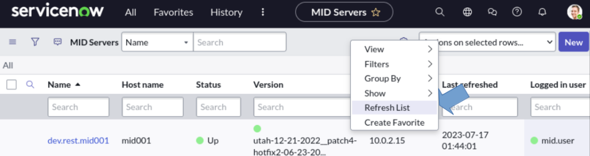

We will also watch the logs during the connection just to confirm there are no errors.

>**TIP**: The most common error(s) at this point is a typo in the config.xml file, the MID Server user record doesn’t have the appropriate permissions, or there is a special character in the password string that the MID Server service isn’t able to parse through. (Example: `'"{}[],/\, etc.) It’s important to note not all special characters are troublemakers. Check these scenarios first before you begin searching ServiceNow documentation for other possible reasons.

```sh
# Start your mid server with the .sh file in the agent directory
sudo ./start.sh

# Follow the log file to see real-time updates made
tail -f ./logs/agent0.log.0
```

Once you have been able to confirm a successful connection, Ctrl+C to exit the tail command and ./stop.sh to stop the MID Server.

```sh
# Stop the MID Server before continuing. 
sudo ./stop.sh
```

Since we are installing multiple Mid Servers on Linux, we need to modify the mid.shconf_override files.

This file is located in _/bin_ inside the agent directory. After opening the mid.shconf_override file, you will need to uncomment the lines _APP_NAME_ and _APP_LONG_NAME_. To uncomment, simply remove the hashtag in front of the variables. These will need to be unique for each service that will be set up on the machine.

```sh
# To view the files/folders in agent (optional)
ls

# Change into the bin folder
cd bin

# Open your file for configuration
sudo nano mid.shconf_override
```

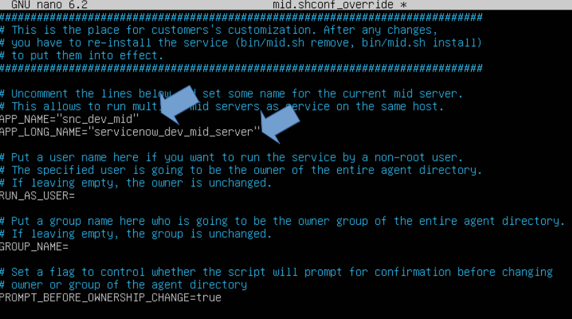

After you have saved the file, the next step is to install the daemon. You can do this by using the ./mid.sh file in the /bin folder you are currently in.

```sh
# Install the daemon, and confirm YES at the prompt
sudo ./mid.sh install

# Once it is done you can start the service again with this command 
sudo ./mid.sh start
```

Check your instance to confirm your mid server is back up and running as expected. If everything looks good, we need to confirm the MID Server service will restart after rebooting the Ubuntu Server. To do this run the command below in your prompt and refresh your MID Server list in ServiceNow.

```sh
# Reboot now
sudo shutdown -r now
```

The last thing we need to do is Validate our MID Server in ServiceNow. This tells ServiceNow that we trust this service and can securely communicate with it.

Click into your MID Server record and in the Related Links section click Validate.

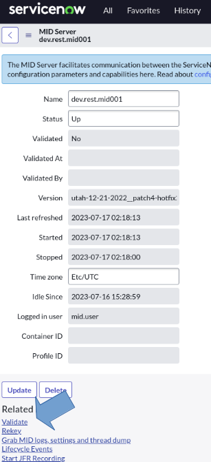

Once validated, you can continue to set up your MID Server inside ServiceNow for its [Capabilities](https://www.servicenow.com/docs/bundle/xanadu-integrate-applications/page/product/mid-server/reference/r_MIDServerCapabilities.html), [IP Ranges](https://www.servicenow.com/docs/bundle/xanadu-servicenow-platform/page/product/mid-server/task/t_ConfigureMIDIPRange.html), and/or [Configuration Parameters](https://www.servicenow.com/docs/bundle/xanadu-servicenow-platform/page/product/mid-server/reference/mid-server-parameters.html).

## Summary

Congratulations you now have a running mid-server. To install your next one, follow these same steps but supply different names for your APP_NAME AND APP_LONG_NAME in your mid.shconf_override file.

To recap what we did:

- We created a MID Server User account with the mid_server role.

- We updated the parameters in the config.xml file to point to our ServiceNow Instance and access it with our user account.

- We updated the mid.shconf_override file so we can have multiple services running.

- We then rebooted the Linux server to confirm our service started again.

You can now configure your new MID Server to communicate with your internal network devices from ServiceNow using REST, Discovery, etc.

Thank you for your time reading this and I hope it was helpful.