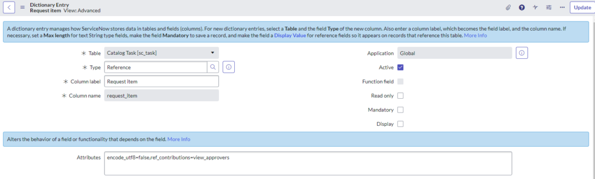
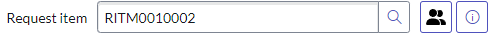

# UI Macro Example


UI Macros provide a way to add discrete scripted components to your user interface. They can assist with adding a UI Script to your form, a decoration on a field, and more. These little snippets are great for small features that need to be provided for your end users.

_For example:_

Your service desk would like to review approvers for Request Items with as few clicks as possible from the Catalog Task. The current process is to use the information decorator on the Request Item field and click to open the record in the current tab or to ctrl+click in a new tab.

In discussions with the team, they decided that a single click to open the approver records directly in a new tab is a good solution. You could do this with a UI Macro.

## Creating a UI Macro

1. In Application Navigator, navigate to **System UI > UI Macros** and click **New**. 

2. Fill in the name field, right-click the context menu, and click **Save**.  In this case, it will be _view_approvers_.

> Note: UI Macros use Jelly, to learn more on this topic please check out the [ServiceNow documentation](https://www.servicenow.com/docs/bundle/utah-application-development/page/script/general-scripting/reference/r_JellyTags.html). Also, these awesome videos by Chuck Tomasi and Andrew Kincaid.ServiceNow Jelly Scripting [Part 1](https://www.youtube.com/watch?v=_MhWugMQegs&list=PLCOmiTb5WX3ouggdJ4ty2dVUSrki9uYr1), [Part 2](https://www.youtube.com/watch?v=Td7t_tiehzY&list=PLCOmiTb5WX3ouggdJ4ty2dVUSrki9uYr1), and [Part 3](https://www.youtube.com/watch?v=gPy5xkks0tA&list=PLCOmiTb5WX3ouggdJ4ty2dVUSrki9uYr1).

3. For this use case we will use the XML code below.
```xml
<?xml version="1.0" encoding="utf-8" ?>
<j:jelly trim="false" xmlns:j="jelly:core" xmlns:g="glide" xmlns:j2="null" xmlns:g2="null">
	<button class="btn btn-default btn-ref" 
	style="background-color: transparent; width: 3.2rem; height: 3.2rem; border: 1px solid rgb(79,82,189)"
	field="${ref}"
        type="button"
	onclick="showApprovers('${ref}')"
        title="${gs.getMessage('Show Approvers')}">
		
	</button>
	<script>
		function showApprovers(reference){
                        // log to the console so you can see what the ${ref} is. 
			console.log(reference); 
			var field = reference.split('.');
			var fieldID = g_form.getValue(field[1]);
			var url = new GlideURL('sysapproval_approver_list.do');
			url.addParam('sysparm_query', 'sysapproval='+fieldID);
			window.open(url.getURL());
		}
	</script>
</j:jelly>
```

_Explanation of code:_

This UI Macro will be used as a decorator on a sys_dictionary field using the **ref_contributions** attribute.

In the example above, a button is created with styling, an on-click handler, a title, and an image using a font awesome .svg icon.

On-click of the button, the reference passed using this piece of code **${ref}**, returns the reference that the UI Macro is attached to, which looks something like this (sc_task.request_item) if on the Catalog Task.Requested Item field. To review this, a log statement is left in so you can review it after clicking the button in the browser console.

In the UI Macro we have access to the client logic of the form, so we can use g_form to get the value of the record we are attached to and open a new window providing parameters to the URL for query information.

The UI Macro is named view_approvers. This naming convention is important so it can be referenced properly in the sys_dictionary attributes.

## Adding the Decorator

 On the Catalog Task record, you can see the Request Item sys_dictionary form by right-clicking on the label and selecting Configure Dictionary.

On the sys_dictionary form, you can use the Advanced View attributes field and add (ref_contributions=view_approvers) or in the related list you can create a new Attributes record for Reference Contributions and provide view_approvers as the value.

The result should look something like this.


With the UI Macro active and in place you should see a button available by your Request Item field on the Catalog Task form. On click, it should direct you to the approvers listed for that Requested Item in a new window.

An example of the decorator I built for this example is below.


If you want a specific image for your decorator you can add an image by navigating to System UI > Images and adding one to the list.

You can see my update set [here](../assets/UI%20Macro%20view_approvers.xml).

### References:

Product Documentation | ServiceNow. (n.d.).

https://docs.servicenow.com/bundle/washingtondc-application-development/page/script/server-scripting/concept/c_UIMacros.html
